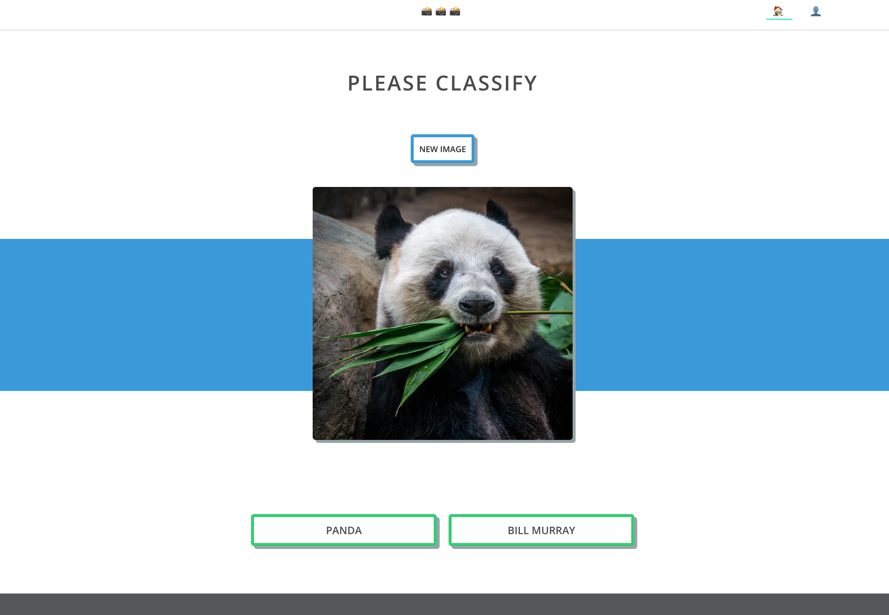

# imtag serverless

An example serverless application. React UI served through AWS Cloudfront. API calls from UI use AWS Route 53 to hit a custom domain name mapping on AWS API Gateway. The API Gateway integrates with AWS Lambda to fetch images and tags from AWS Aurora Serverless.

## Architecture Diagram

<div style="text-align:center">
  
</div>

## Web Design File

<div style="text-align:center">
  
</div>


## Structure

It is best to use mutliple repos for the different parts of the application, but they are all under one repo here for easy of discovery.

```text
├── imtag-api
│   ├── imtag-api-images            - API Gateway and Lambda setup for images api
│   ├── imtag-api-tags              - API Gateway and Lambda setup for tags api
│   └── lambda-layer-pymysql        - Lambda Layer for pymysql database connection
├── imtag-db                        - Setting up AWS Aurora
├── imtag-ui                        - React UI which is hosted on S3
└── imtag-vpc                       - Network setup for vpc and sunets
```

## Guide

Check out the [guide](guide) folder to walk through setting up the application and catch a bit of what I learned going through the process
