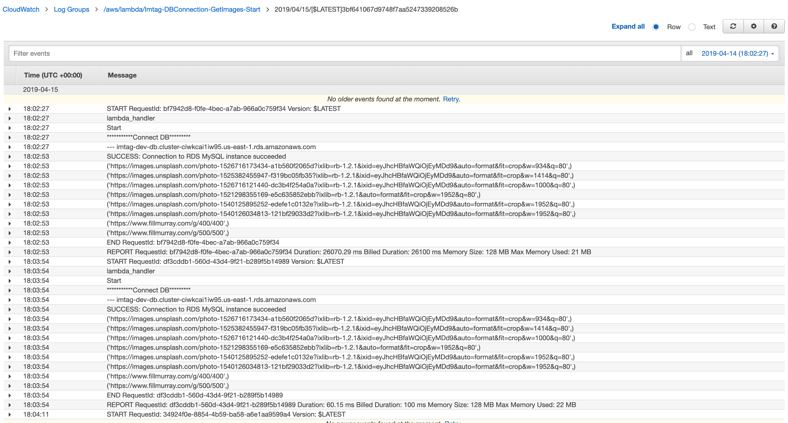
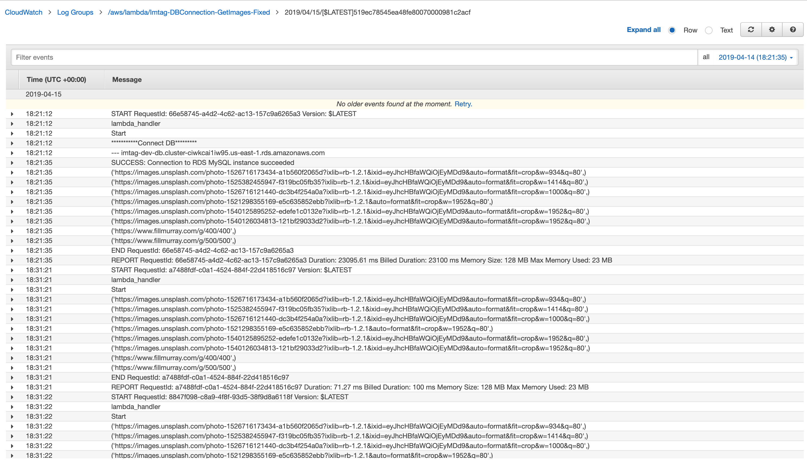

# Example of DB connection reuse

`starting_lambda` uses a new connection each time lambda is invoked. The `fixed_lambda` moves the db connection into a global variable where it is reused when available. It is validation to see the cloud watch log stream for the function where you can identify that the connection function is only being called once per container. If there is a cold start (new container provisioned to handle function invocations) a new connection will be established

I have uploaded both functions to lambda and run the functions to capture logs.

## Starting Lambda Logs

You notice here the DB connection is made on each invocation

## Fixed Lambda Logs

You notice here the DB connection is only made once in a container, a warm start will reuse the connection

