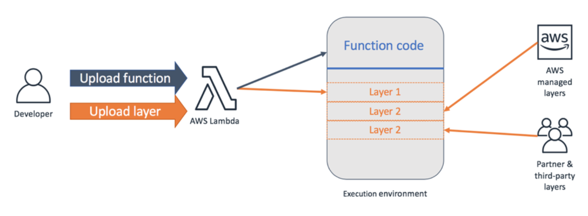

# Lambda Layers

We have two apis both using the function to connect to the database. Its not too much of a hassle to copy it over and reuse, but does mean we are duplicating ourselves and any more functions will also need to have the same logic.

Lambda layers is a great use case for this.

## Setup

Docs for walking through setting up a layer is located [imtag/imtag-api/lambda-layer-pymysql](imtag/imtag-api/lambda-layer-pymysql)
