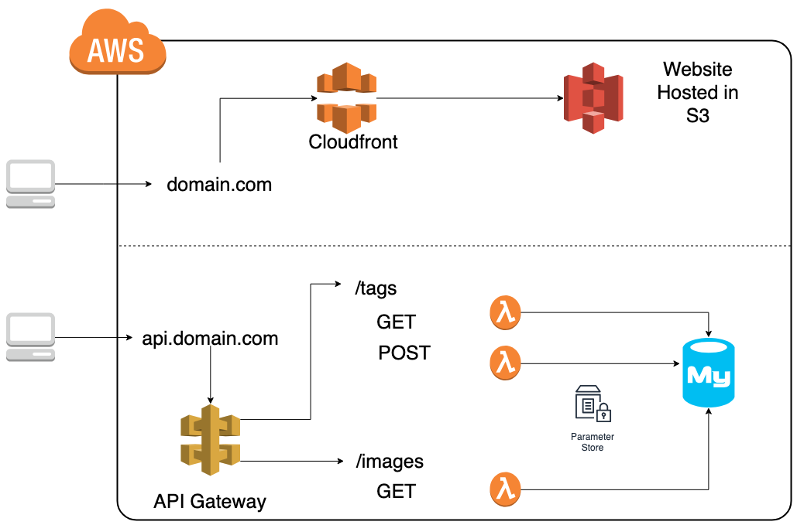
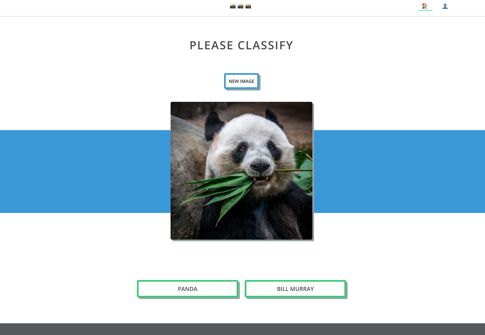

# Imtag Serverless Guide

This application is created to be a reference point for getting started building with AWS SAM

## Guide Steps

---

### Intro

#### The Buzz Word 🐝🐝

Serverless is generating a lot of buzz for sure. Some doubt its staying power, but im confident its here to stay. Its just another step towards offloading operations work that doesnt differentiate. Serverless Framework prepared a great [survey about serverless usage in the community](https://serverless.com/blog/2018-serverless-community-survey-huge-growth-usage)

Highlights

- More usage and +50% in critical work loads

- Developers still unsure how to manage and test what can become the serverless sprawl.

- Node (50%) and Python (20%) are languages of choice

#### Cat Herder 🐈🐈🐈

It can feel like herding cats. Good repo management, CI/CD, versioning/aliasing is going to be critical to keeping sanity in this new world.

The original cat herders can empathize watch the video below

Excited about the trajectory of serverless. Optmistic we will see alot of the current issues handled and even more capabilities opened up. Amazing dev experience to just have src code and a way to interface with that. Super single responsibility

---

### Serverless Example App Overview

You have been assigned to build an application for tagging data for your ML models. This application requirements are:

- API to receive image from database
- API to receive tags from database
- API to post image with tag name tied to the user performing the action
- API to receive what tags user has created
- Have a nice interface for users to quickly be able to access

Here is what network diagram would be

Here is a design file from the designer

### Set up VP

Start by setting up the VPC. There is a nice cloud formation script used to make this easy located in the repo

[imtag-vpc](../imtag-vpc)

### Set up Database

Of course we need to get our DB. This guide walks through Aws Aurora Serverless, but expirement with your own as well.

[imtag-db](../imtag-db)

### Lambda Layer

Set up the lambda to get images from your database

[imtag-api/lambda-layer-pymysql](../imtag-api/lambda-layer-pymysql)

### Images API and AWS SAM

Set up the lambda to get images from your database

[imtag-api/imtag-api-images](../imtag-api/imtag-api-images)

### Tags API and AWS SAM

Set up another lambda function to get tags from your database

[imtag-api/imtag-api-tags](../imtag-api/imtag-api-tags)

### Setup UI

The ui is built with React library. Build and push to an s3 bucket and then configure for website hosting. An extra step is to use the bucket as origin to cloudfront. Add rotue 53 to point to the cloudfront distribution.

[imtag-ui](../imtag-ui)

Youll need to configure your endpoints in the api folder to match where your images and tags api gets deployed to. [UI Apis are here](../imtag-ui/src/core/apis)
